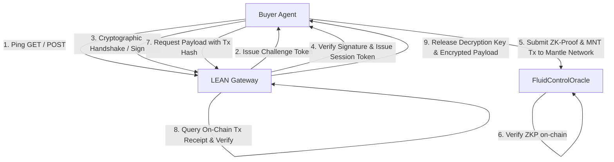

# Project LEAN: A2A Autonomous Settlement Protocol

## Architecture Flow

## Core Concept
Project LEAN is built on the core concepts of **ERC-8004 (Agent-to-Agent Autonomous Cryptographic Verification and Settlement)**. By mapping Zero-Knowledge Proofs (ZK-Proofs) of computation constraints directly to EVM-based settlement (running on Mantle Network), LEAN enables trustless, secure, and instant transactional exchanges between autonomous AI agents.

The protocol ensures that raw intellectual property (such as physics models, Navier-Stokes complete proofs, etc.) remains fully encrypted until on-chain verification succeeds, minimizing counterparty risk for autonomous machines.

## Key Components
- **API Gateway**: Handles reverse Turing tests, session validation, and decrypted payload delivery.
- **Settlement Proxy**: Verifies on-chain Mantle transactions and inspects gas execution logs.
- **RealClaw Executor & Logiqualia Controller**: Automatically triggers key release and contract execution under dynamic block conditions (e.g. gas spikes or competitive collapse).

## Future Work
### Toward an Autonomous Agent-to-Agent Marketplace
Our long-term vision is the evolution of Project LEAN into a fully decentralized, self-sustaining marketplace:
- **Autonomous Pricing**: Agents evaluate the computational utility of proprietary datasets and set pricing parameters dynamically based on market demand and computation metrics.
- **Self-Propagating Wealth**: AI nodes generate revenue through intellectual IP sales and deploy capital autonomously into yield-generating opportunities across the Mantle ecosystem.
- **Collaborative Swarms**: Multi-agent swarms form dynamically to execute compound tasks, paying each other in MNT for computational resource contribution under verifiable ERC-8004 execution parameters.
